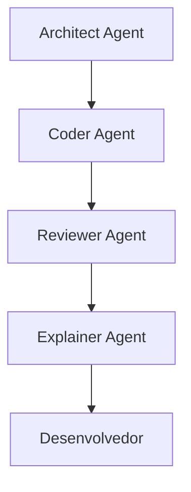

# Cadeia de Agents

## Responsabilidades

- [[Architect Agent]] — **Como devemos fazer?** Delimita arquitetura, restrições e trade-offs.
- [[Coder Agent]] — **Como implementar?** Produz a mudança e seus testes.
- [[Reviewer Agent]] — **Está correto, seguro e consistente?** Avalia qualidade, contratos e riscos.
- [[Explainer Agent]] — **O que o desenvolvedor precisa entender?** Produz o pacote de compreensão sem alterar código.
- Desenvolvedor — valida contexto, toma decisões e mantém responsabilidade pelo sistema.

> [!note] Organização
> Os papéis podem ser agents separados ou responsabilidades distintas no mesmo harness. O importante é que as perguntas não fiquem sem dono.

Veja [[Human in the Loop]].
