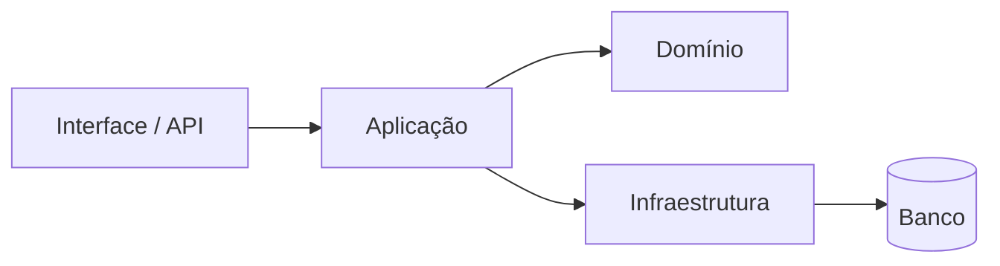

# Architecture Overview

Esta nota é o mapa arquitetural de qualquer projeto analisado. Preencha-a com evidências do repositório, não com uma arquitetura idealizada.

## Visão geral

- **Propósito do sistema:**
- **Limites e contexto externo:**
- **Estilo arquitetural observado:**

## Camadas e módulos

O diagrama é apenas um exemplo. Substitua-o pela estrutura real e registre dependências proibidas em [[Dependências entre Camadas]].

## Inventário de investigação

- **Pontos de entrada:** rotas, CLIs, jobs, consumidores de eventos.
- **Integrações:** serviços externos, filas, cache e autenticação.
- **Persistência:** bancos, modelos, migrações e transações.
- **Fluxos principais:** links para notas de mudanças e casos de uso.
- **Decisões arquiteturais:** [[Decisões Arquiteturais]] e [[ADR]].

## Perguntas

1. Que componente pode depender de qual?
2. Onde ficam regras que não podem variar com infraestrutura?
3. Que integração define o maior risco operacional?
