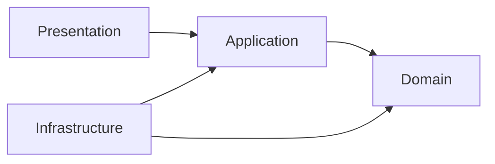

# Dependências entre Camadas

Camadas existem para conter mudanças: regra de negócio não deveria conhecer detalhes de banco, framework HTTP ou fornecedor externo. Essa separação permite testar e substituir infraestrutura com menor efeito cascata.

## Como documentar no projeto

Para cada dependência, registre origem, destino, contrato usado e motivo. Questione principalmente dependências que atravessam domínio → infraestrutura, pois elas dificultam isolamento e teste.

O sentido real depende do estilo adotado; não force esse modelo. Use interfaces como [[Repository Pattern]] ou [[Dependency Injection]] somente quando reduzem um acoplamento relevante.

## Perguntas

- O que quebraria se o fornecedor de persistência fosse trocado?
- Qual abstração protege a regra de negócio do detalhe externo?
