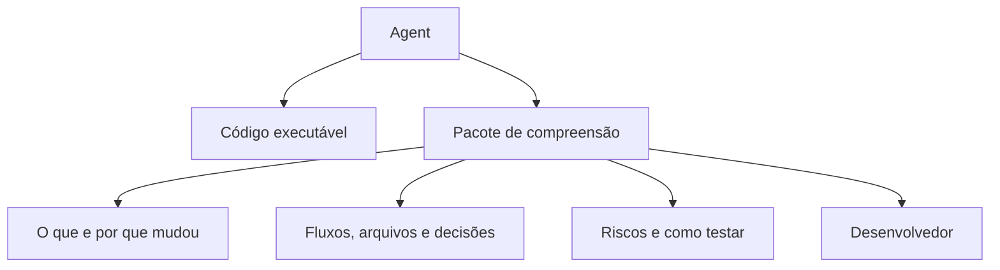

# Code Understanding Layer

## Por que existe?

Código executável não é, por si, uma explicação suficiente de intenção, trade-offs e impacto. A *Code Understanding Layer* é a camada entre a entrega do agent e o responsável humano que preserva essas respostas.

## Como funciona

Um agent especializado lê a tarefa, o diff, os arquivos alterados, a arquitetura, os testes e as dependências. Ele então produz um pacote de compreensão que aponta o que investigar — sem repetir cada linha do código.

## O que deve conter

- mudança e motivação;
- fluxos de execução e dados;
- arquivos, abstrações, dependências e decisões;
- riscos, estratégia de teste e conceitos a estudar.

> [!warning] Limite
> A camada não substitui revisão nem responsabilidade humana. Ela torna a revisão mais orientada e auditável.

## Relacionado

[[Explainer Agent]] · [[Reviewer Agent]] · [[Developer Comprehension]] · [[Análise por Diff]]
